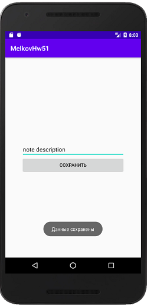

## Задача 1. Записная книжка в SharedPreferences.
### Описание
Одно из самых популярных приложений на телефон - это заметки. Давайте создадим свои собственные. Элементы приложения:
- EditText с заметкой.
- Кнопка “Сохранить” (при клике на нее, заметка сохраняется в SharedPreferences).
При перезапуске приложения, если заметка ранее была сохранена, она отображается в EditText компоненте.

